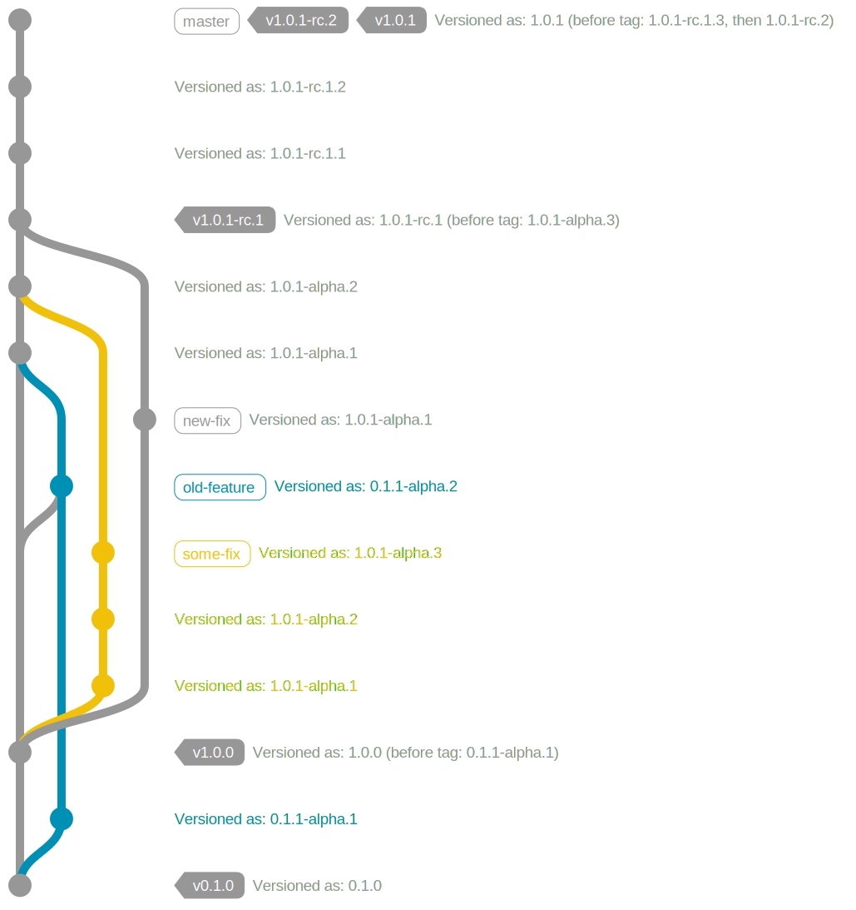

# Version Calculation In Depth

To calculate a version, Verlite takes the head commit for the "current commit," and until the "current commit" is tagged with a version, will keep checking the *first* parent only. Once a commit with a version tag is found, the highest tag is used for calculating future versions. If the number of commits traversed is zero, the version specified in the tag is used verbatim, otherwise the version is bumped, and a height appended. If the last tag was a prerelease, then the height will be appended in full to that prerelease, otherwise the default phase will be used ("alpha").

The graph below should give you a good idea for how things are versioned.

Take note how the `old-feature` branch predates the version, taking only the version from when it originally branched, even after merging in a commit. It is for this reason squashing or merge commits should always be used, as only the first parent is taken into account upon version calculation.

Note how there are multiple commits versioned as `1.0.1-alpha.n`, this is a result of both: commits in Git not being on a branch; and Verlite being branch-blind.