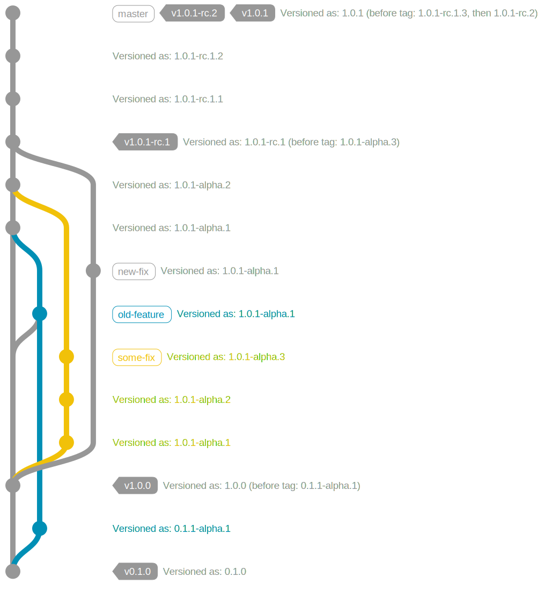

# Version Calculation In Depth

To calculate a version, Verlite takes the head commit for the "current commit," and until the "current commit" is tagged with a version, will keep checking parents. Once a commit with a version tag is found, the highest tag is used for calculating future versions. If the number of commits traversed is zero, the version specified in the tag is used verbatim, otherwise if the tag is a stable release, the version is bumped, appending a prerelease label (by default "alpha") and height, else the height with a separator will a be appended in full to to the previous tag's version (including prerelease label) with no major/minor/patch version bump.

The graph below should give you a good idea for how things are versioned.

Note how there are multiple commits versioned as `1.0.1-alpha.n`, this is a result of both: commits in Git not being on a branch; and Verlite being branch-blind—this is expected behavior, and in no way an error. Builds with "height" should not be released beyond development channels such as nightly builds for internal testing. These "nightly" releases should be done so only from a specific branch (such as `master` and/or `support/*`) in order for deliverables to maintain a monotonic commit height.

The same commit can be released multiple times if tagged again with a higher version. In practice, this will most often be done with release candidates, and can be seen in the graph above, where the `HEAD` commit was tagged and released under both `1.0.1-rc.2` and `1.0.1`.